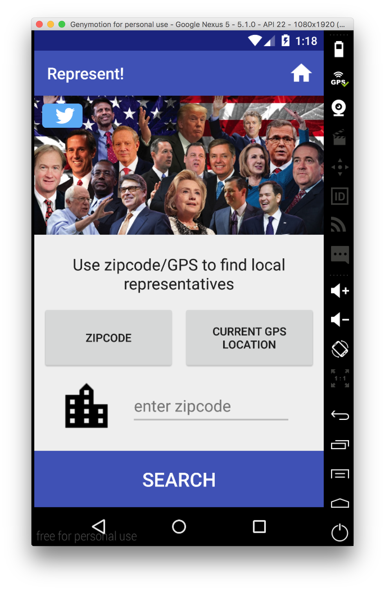
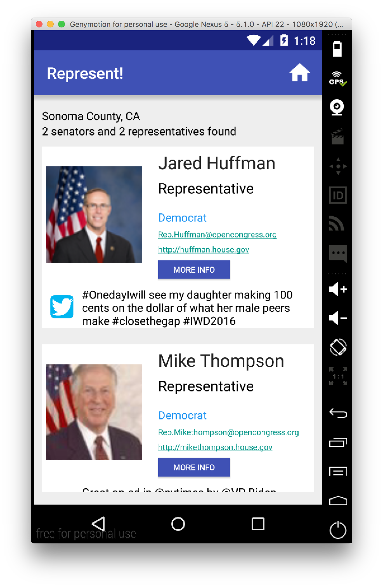
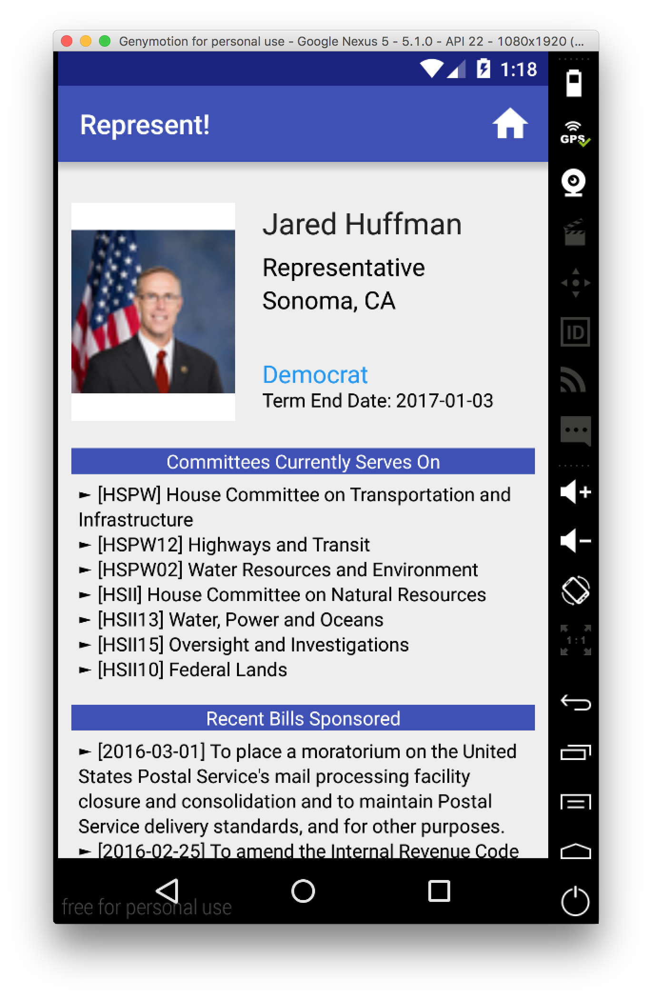
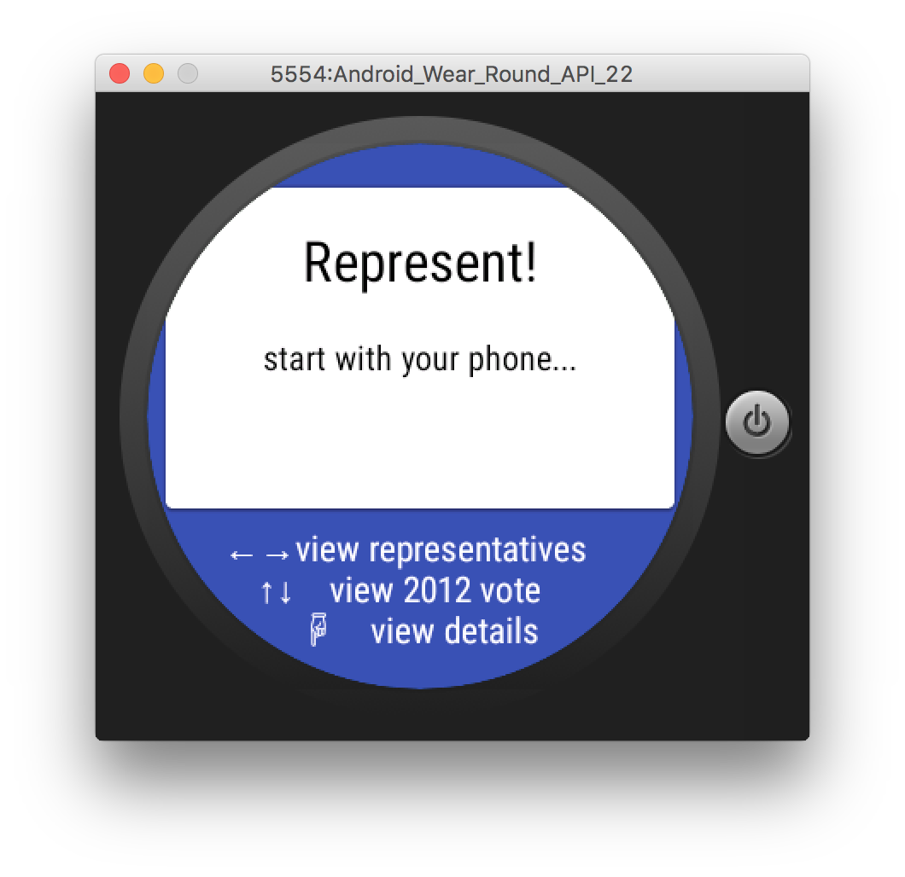
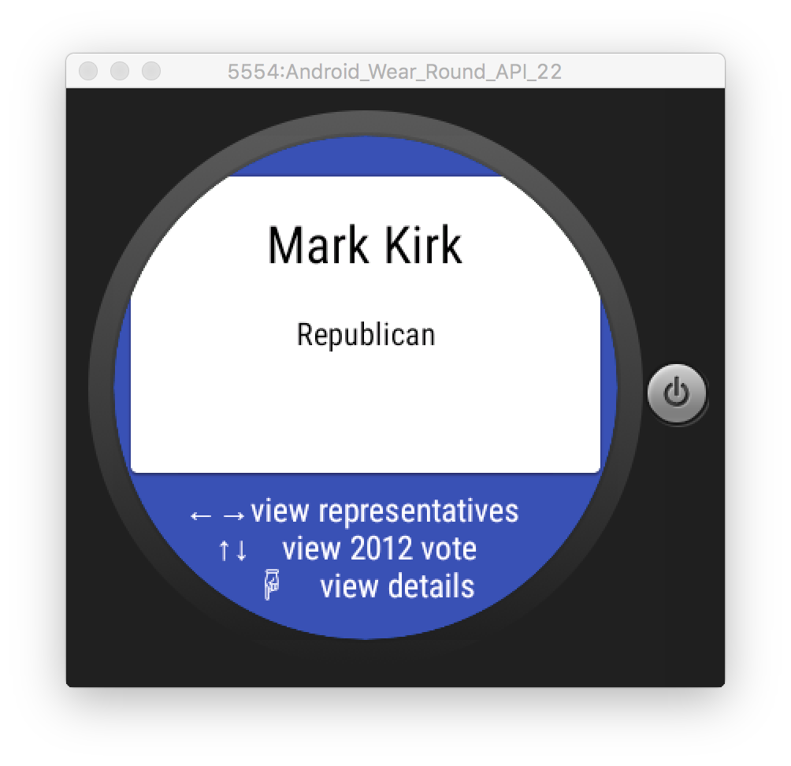
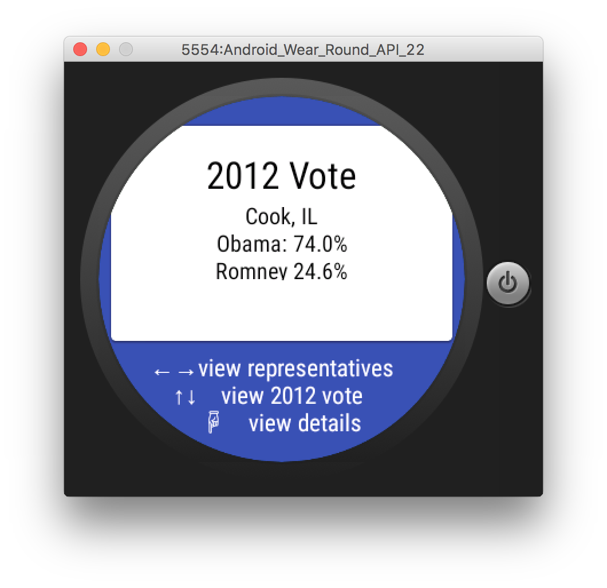

# PROG 02: Represent!

Represent! is an application for voters to check the information of the congressional representatives of a given location. It also encorporates android wear manipulation for browsing informations. Start off by choosing how to find congress members: by zipcode or by your current location. Represent! is a homework of C260A UI Design, implemented by Jiayuan Chen

Core functionalities:
* Mobile: Main, Congressional, Detailed; Watch: Main, 2012 Vote
* The Main View (mobile) allow users to input a zip code/current location, and open both a Congressional View on the phone and a Main View on the watch with the appropriate information
* Can swipe through a list of congressional representatives on the watch
* Selecting a member of congress on the watch change the Detailed View on the phone
* Changing the location result in a change in the results of the 2012 Vote View
* Changing the accelerometer value of the watch (to simulate a shake) randomly select a location in the US, updating information accordingly

## Authors

Jiayuan Chen ([jiayuan.chen@berkeley.edu](mailto:jiayuan.chen@berkeley.edu))

## Demo Video

Figma: [https://www.figma.com/file/CYfQ9I3wvsqStaPLXhIM0u3Y/Represent] (https://www.figma.com/file/CYfQ9I3wvsqStaPLXhIM0u3Y/Represent)
Phase B: [https://youtu.be/Fxei3xo_7w4] (https://youtu.be/Fxei3xo_7w4)
Phase C: [https://youtu.be/ASSodZHhMdk] (https://youtu.be/ASSodZHhMdk)
 
## Screenshots

## Acknowledgments

Some useful websites
* [https://fabric.io/dashboard] (https://fabric.io/dashboard)
* [http://developer.android.com/reference/android/os/AsyncTask.html] (http://developer.android.com/reference/android/os/AsyncTask.html)
* [https://developers.google.com/maps/documentation/geocoding/intro] (https://developers.google.com/maps/documentation/geocoding/intro)
* [http://sunlightfoundation.com/] (http://sunlightfoundation.com/)
* Android Developer Site
* Set up guide on CS160 webpage
